# NocoUI for Siv3D

[](https://github.com/m4saka/NocoUI/actions/workflows/ci.yml?query=branch%3Amaster)

> [!WARNING]
> NocoUIは現在プレビュー版として試験的に公開されています。  
> 今後のアップデートで大規模な仕様変更が発生する可能性があるため、ご利用の際はご注意ください。

NocoUIは、Siv3D向けのUIライブラリです。

ゲームで利用する複雑なUIのレイアウトを、ビジュアルエディタ（NocoEditor）で直感的に編集できます。  
作成したUIは、数行のコードを書くだけで簡単に利用可能です。

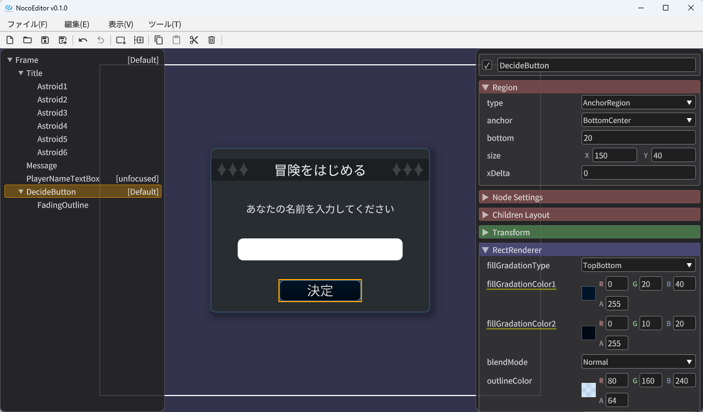
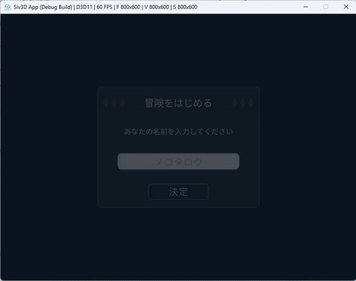

※ 上記スクリーンショットのMain.cppおよび.nocoファイルのサンプルは、[examples/PlayerNameDialog](./examples/PlayerNameDialog)内にあります。

## 基本的な使い方

NocoEditorで作成したCanvasファイル(.noco)を、下記のようにソースコードで読み込んで利用します。

```cpp
#include <Siv3D.hpp>
#include <NocoUI.hpp>

void Main()
{
    // NocoUIを初期化
    noco::Init();

    // ファイルからCanvasを読み込み
    const auto canvas = noco::Canvas::LoadFromFile(U"canvas.noco");

    while (System::Update())
    {
        // Canvasを更新
        canvas->update();

        // Canvasを描画
        canvas->draw();
    }
}
```

## NocoUIの特徴

NocoUIの"Noco"という名前は、以下の2つの特徴に由来します。

- ノーコード (**No** **Co**de)
    - UIの見た目をビジュアルエディタで編集できます。
    - 見た目に関する値（座標、色、画像ファイル名、テキストなど）を、.nocoファイル（JSON形式）として保存することで、ソースコードをシンプルに保てます。

- ノード＆コンポーネントUI (**No**de & **Co**mponent-based UI)
    - ノード（`Node`）: 座標とサイズを持つ要素。複数のコンポーネントを持つことができます。
    - コンポーネント（`Component`）: ノードに追加することで、さまざまな処理や描画を行うことができます。

## プロジェクトへの導入方法

### Windows (Visual Studio) の場合

下記の手順でソリューションにNocoUI.vcxprojを追加し、プロジェクトの依存関係を設定してください。  
ここでは例として、「MySiv3DProject」という名前のSiv3Dプロジェクトが既に存在するものとします。

1.  NocoUIをダウンロードし、ソリューション内の任意のディレクトリにNocoUIフォルダを配置します。

2.  Visual Studioのソリューションエクスプローラーでソリューション（先頭の項目）を右クリックし、「追加 > 既存のプロジェクト」を選択します。  
    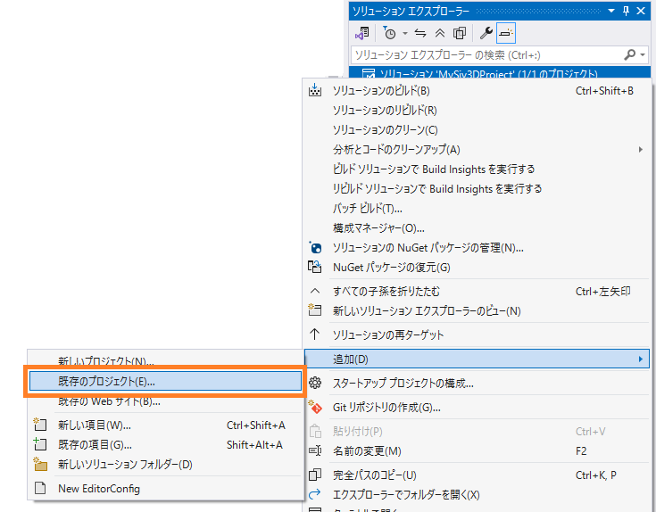

3.  配置したNocoUIフォルダ内のNocoUI.vcxprojを選択します。

4.  ソリューションに「NocoUI」プロジェクトが追加されます。  
    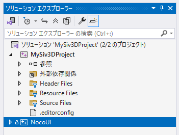

5.  「MySiv3DProject」プロジェクトを右クリックし、「ビルドの依存関係 > プロジェクトの依存関係」を選択します。  
    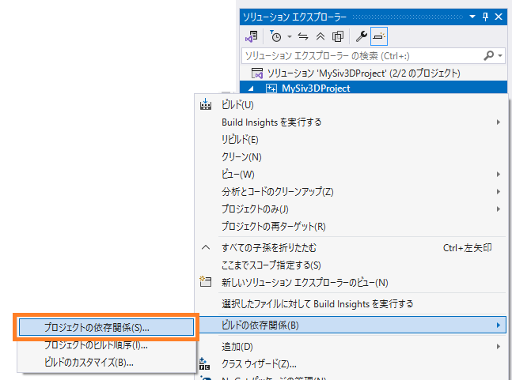

6.  表示されたウィンドウで「NocoUI」にチェックを入れ、OKボタンで閉じます。  
    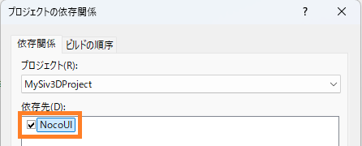

7.  「MySiv3DProject」プロジェクトの「参照」を右クリックし、「参照の追加」を選択します。  
    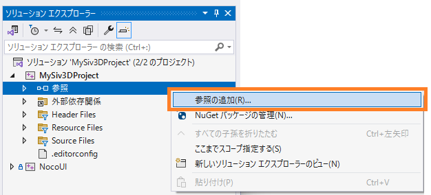

8.  表示されたウィンドウで「NocoUI」にチェックを入れ、OKボタンで閉じます。  
    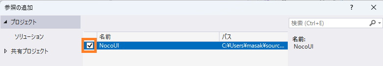

9.  「MySiv3DProject」プロジェクト内のstdafx.hに「`#include <NocoUI.hpp>`」を追記します。  
    （※必須ではありませんが、ビルド速度向上のため推奨します）

10. これで、プロジェクトでNocoUIが利用できるようになりました。

> [!NOTE]
> プロジェクトにNocoUIのcpp・hppファイルを直接追加しても利用できますが、上記の手順で導入すると、将来のアップデート時にNocoUIフォルダを上書きするだけで済むため便利です。

### macOS/Linux の場合

プロジェクト内の任意のディレクトリにNocoUIフォルダを配置してください。

そのうえで、NocoUIのincludeフォルダをインクルードパスに追加し、srcフォルダ内のcppファイルがビルド対象になるようプロジェクトに手動で追加してください。

※ Linux向けに、現在CMakeを利用した導入方法を準備中です。

## コンポーネントの種類

以下のコンポーネントが標準で搭載されています。  
各コンポーネントの詳しい機能は、エディタでコンポーネントを挿入し、プロパティ名にマウスカーソルを合わせるとツールチップで表示されます。

### 主要なコンポーネント

- `Sprite`: 画像を描画します。9スライス、フレームアニメーション、スクロールアニメーションなどに対応しています。
- `RectRenderer`: 長方形を描画します。角丸、枠線、グラデーションなどに対応しています。
- `TextBox`: 1行のテキスト入力ができます。`TextBox`自体は背景を描画しないため、`RectRenderer`と組み合わせて利用します。
- `Label`: テキストを描画します。フォント指定、下線、水平/垂直方向の配置、フォントサイズの自動縮小、アウトライン、影などに対応しています。
- `Tween`: 位置、スケール、回転、色をアニメーションさせます。

### その他のコンポーネント

- `ShapeRenderer`: Siv3Dの`Shape2D`で定義されている各種図形を描画します。
- `TextArea`: 複数行のテキスト入力ができます。`TextArea`自体は背景を描画しないため、`RectRenderer`と組み合わせて利用します。
- `Toggle`: クリックするたびに`value`プロパティ（bool）の値が切り替わります。チェックボックスの実装などに利用できます。
- `TextureFontLabel`: あらかじめ用意したフォントテクスチャ画像をもとに、テキストを描画します。
- `EventTrigger`: マウスイベントに応じてイベントを発火します。イベントはプログラム側から取得できます（`Canvas::isEventFiredWithTag`, `Canvas::getFiredEvent(s)WithTag`, `Canvas::getFiredEventsAll`）。
- `CursorChanger`: ホバー中のマウスカーソルの見た目を変更します。
- `UISound`: マウスイベントに応じて効果音を再生します。

## レイアウト (Children Layout)

レイアウトは、子ノードのうち`InlineRegion`が指定されたノードの配置方法を定義します。

以下の3種類があります。

- `FlowLayout`
    - 子ノードを左上から順番に配置します。
    - 右端に到達すると、次の行へ折り返します。

- `HorizontalLayout`
    - 子ノードを左から右へ一列に配置します。
    - 右端に到達しても折り返しません。

- `VerticalLayout`
    - 子ノードを上から下へ一列に配置します。
    - 下端に到達しても折り返しません。

## リージョン (Region)

Regionは、ノード自身の領域を指定します。

以下の2種類があります。

- `AnchorRegion`
    - 親ノードの領域を基準に、自身の位置とサイズを決定します。
    - 親のレイアウト設定は無視されます。

- `InlineRegion`
    - 親のレイアウト設定に従って、順番に配置されます。

> [!WARNING]
> リージョンは`Node::setRegion()`で動的に変更可能ですが、変更のたびにフレームの最後にCanvas全体のレイアウト再計算が発生するため、頻繁な変更は推奨されません。  
> アニメーションのようにプログラムから頻繁に値を変更する場合は、リージョンではなくトランスフォームを利用してください。

## トランスフォーム (Transform)

トランスフォームは、ノードの位置、サイズ、回転、スケール、色を変化させるために使用します。

- `translate`: ノードの位置を変化させます (Vec2)
- `scale`: ノードのスケールを変化させます (Vec2)
- `rotation`: ノードの回転を変化させます (double)
- `pivot`: ノードの回転・スケールの基点を0～1の割合で指定します (Vec2)
- `color`: ノードの色を変化させます (Color)
- `hitTestAffected`: ヒットテストの領域にもトランスフォームを適用するかどうか (bool)

トランスフォームはノードのレイアウト計算に影響しないため、変更してもレイアウト再計算が発生しません。そのため、アニメーションなどの用途に適しています。

## ヒットテスト

ヒットテストは、マウスカーソルがどのノード上にあるかを判定する仕組みです。

ノードごとに、以下のプロパティでヒットテストの挙動を制御できます。

- `isHitTarget`: ヒットテストの対象にするかどうか (bool)
    - `false`に設定すると、代わりに親ノードのヒットテスト結果を利用します。

- `hitPadding`: ヒットテスト領域の余白 (LRTB)
    - ノードのヒットテスト領域を、指定したピクセル数だけ拡大・縮小します。

## ステート

各ノードは、インタラクションステートとスタイルステートという2種類のステートを持ちます。

プロパティ名を右クリックして「ステート毎に値を変更...」を選択すると、ステートごとのプロパティ値を設定でき、ステートに応じて見た目を切り替えられます。  
ステートごとの値が設定されたプロパティは、プロパティ名に黄色い下線が表示されます。

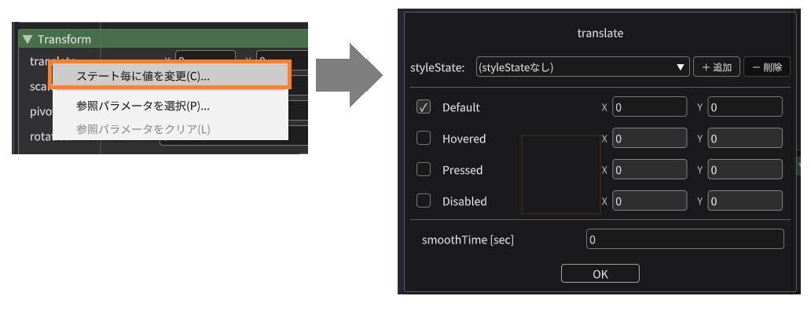

### インタラクションステート (Interaction State)

マウス操作に応じて自動的に切り替わるステートです。

インタラクションステートは、以下の4種類のうちいずれかの状態を持ちます。

- `Default`: 通常時
- `Hovered`: マウスホバー中
- `Pressed`: マウスボタン押下中
- `Disabled`: 無効状態

ノードの`interactable`プロパティを`false`に設定すると、ノードは`Disabled`ステートになります。

子ノードのインタラクションステートを親に継承させるには、親ノードで以下のプロパティを有効にします。

- `inheritChildrenHover`: 子ノードのホバー状態を親に継承します。
- `inheritChildrenPress`: 子ノードの押下状態を親に継承します。

### スタイルステート (Style State)

スタイルステートは、ノードの見た目を切り替えるために自由に利用できるステートです。  
文字列で指定でき、1つのノードは1つのスタイルステートを持ちます。

祖先ノードのスタイルステートは再帰的に継承され、自身に近いノードのものが優先的に適用されます。

※ 子ノードのスタイルステートは、親には継承されません。

#### コンポーネントによるスタイルステートの上書き

一部のコンポーネントは、自身の状態に応じてスタイルステートを上書きすることがあります。以下がその例です。

- `TextBox`/`TextArea`コンポーネント
    - `"focused"`: フォーカス中に上書きされます。
    - `"unfocused"`: フォーカスされていない時に上書きされます。

- `Toggle`コンポーネント
    - `"on"`: `value`プロパティが`true`の時に上書きされます。
    - `"off"`: `value`プロパティが`false`の時に上書きされます。

これらのスタイルステートに対応するプロパティ値を設定しておくことで、コンポーネントの状態に応じて自動的に見た目を切り替えられます。

## パラメータ (Params)

パラメータは、各コンポーネントのプロパティ値を外部から動的に変更するための仕組みです。
テキストの内容だけが異なるUIなど、似たようなUIを再利用する際に便利です。

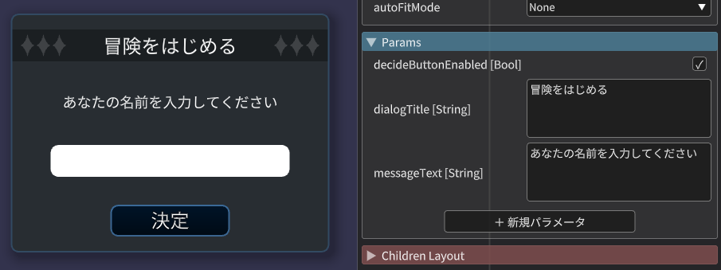

パラメータを利用したい場合、プロパティ名を右クリックして「参照パラメータを選択...」を選択すると、パラメータ参照の設定ができます。  
パラメータ参照が設定されたプロパティは、プロパティ名に水色の下線が表示されます。

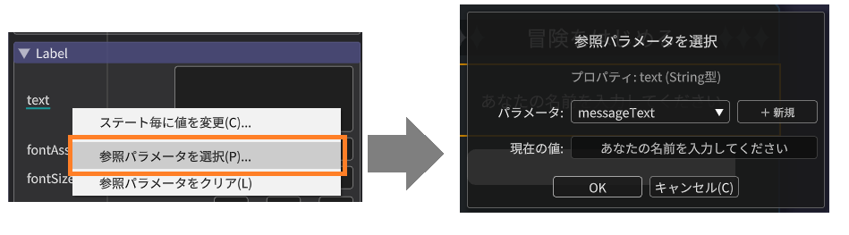

パラメータ参照を設定すると、下記のようにソースコードから簡単に値を設定できるようになります。

```cpp
// Before: パラメータ不使用の場合、ノードとコンポーネントを取得する必要がある
const auto titleNode = canvas->findByName(U"Title");
const auto titleLabel = titleNode->getComponent<noco::Label>();
titleLabel->setText(U"新たな仲間が参戦！");

const auto messageNode = canvas->findByName(U"Message");
const auto messageLabel = messageNode->getComponent<noco::Label>();
messageLabel->setText(U"仲間の名前を入力してください");
```
　　↓
```cpp
// After: パラメータ参照を利用すると、Canvasから直接値をセットできる
canvas->setParamValue(U"dialogTitle", U"新たな仲間が参戦！");
canvas->setParamValue(U"messageText", U"仲間の名前を入力してください");
```

### パラメータ参照が利用可能なプロパティ

以下のプロパティでパラメータ参照が利用可能です。

- ノードの一部プロパティ
    - アクティブ状態(`activeSelf`)
    - インタラクション可能か(`interactable`)
    - スタイルステート(`styleState`)
    - 兄弟ノードの前後関係(`zOrderInSiblings`)
- トランスフォームの全プロパティ
- コンポーネントの全プロパティ

## 独自コンポーネントの利用 (高度な使い方)

独自コンポーネントを作成するには、以下の2つの方法があります。

### 方法1: `SerializableComponentBase`を継承してエディタ上で使用

エディタで独自コンポーネントを使用するには、`noco::SerializableComponentBase`を継承してコンポーネントを作成します。

```cpp
// enumも使用可能
enum class IconType
{
    None,
    Home,
    Settings,
    Search,
};

// 独自コンポーネント
class CustomButton : public noco::SerializableComponentBase
{
private:
	noco::Property<String> m_text{ U"text", U"" };
	noco::SmoothProperty<Color> m_backgroundColor{ U"backgroundColor", Palette::White };
	noco::SmoothProperty<Color> m_textColor{ U"textColor", Palette::Black };
	noco::SmoothProperty<double> m_fontSize{ U"fontSize", 16.0 };
	noco::Property<bool> m_enabled{ U"enabled", true };
	noco::Property<IconType> m_iconType{ U"iconType", IconType::None };

public:
	CustomButton()
		: noco::SerializableComponentBase{
			U"CustomButton",
			{
				&m_text,
				&m_backgroundColor,
				&m_textColor,
				&m_fontSize,
				&m_enabled,
				&m_iconType
			} }
	{
	}

	void update(const std::shared_ptr<noco::Node>&) override
	{
		// 更新処理
	}

	void draw(const noco::Node&) const override
	{
		// 描画処理
	}
};
```

次に、NocoEditorの実行ファイルがある場所を基準として`Custom/Components`ディレクトリに、コンポーネントのスキーマ定義をJSON形式で記述して配置します。
例えば、`Custom/Components/CustomButton.json`として下記の内容を配置します。

```json
{
	"type": "CustomButton",
	"properties": [
		// (中略)
	]
}
```

これにより、下記のようにNocoEditor上で独自コンポーネントが追加できるようになります。

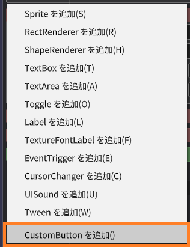

プログラムで独自コンポーネントを利用するには、`ComponentFactory`を取得してコンポーネントを登録し、`Canvas::LoadFromFile`の第2引数に渡します。
```cpp
// 標準コンポーネントを含むComponentFactoryを取得
noco::ComponentFactory factory = noco::ComponentFactory::GetBuiltinFactory();

// 独自コンポーネントを登録
factory.registerComponentType<CustomButton>(U"CustomButton");

// Canvasを読み込む際にfactoryを渡す
const auto canvas = noco::Canvas::LoadFromFile(U"canvas.noco", factory);
```

### 方法2: `ComponentBase`を継承してプログラム上で使用

独自コンポーネントをプログラムでのみ使用する場合は、`noco::ComponentBase`を継承して作成します。

なお、この方法でステートに応じた値の変化が不要であれば、`Property`や`SmoothProperty`を使わずに実装することも可能です。

```cpp
// 独自コンポーネント
class CustomButton : public noco::ComponentBase
{
private:
    String m_text = U"";
    Color m_backgroundColor = Palette::White;

public:
    CustomButton(StringView text, const Color& backgroundColor)
        : noco::ComponentBase{ {} } // プロパティが不要な場合は空の配列を渡す
        , m_text{ text }
        , m_backgroundColor{ backgroundColor }
    {
    }

    void update(const std::shared_ptr<noco::Node>&) override
    {
        // 更新処理
    }

    void draw(const noco::Node&) const override
    {
        // 描画処理
    }
};
```

プログラムでは、`emplaceComponent`または`addComponent`でノードへ追加して利用します。

```cpp
node->emplaceComponent<CustomButton>(U"OK", Palette::White);
// または
node->addComponent(std::make_shared<CustomButton>(U"OK", Palette::White));
```

## Editor上での独自フォントのプレビュー (高度な使い方)

NocoEditorで独自フォントをプレビューするには、`Custom/FontAssets`ディレクトリにフォントアセット定義（.json）を配置します。  
これにより、`Label`コンポーネントなどの`fontAssetName`プロパティで指定したフォントが、エディタ上でプレビューできるようになります。

これはあくまでエディタでのプレビュー用のアセット定義です。実際のプログラムで利用するには、別途Siv3Dの`FontAsset::Register()`でフォントアセットを登録する必要があります。

### フォントファイル(.ttf/.otf)の場合

例えば、`Custom/FontAssets/MyFont.json`と`Custom/FontAssets/MyFont.ttf`を配置し、フォントアセット定義（.json）に下記の内容を記述します。

```json
{
  "fontAssetName": "MyFont",
  "fontSize": 32,
  "method": "MSDF",
  "style": "Bold",
  "source": {
    "type": "File",
    "path": "MyFont.ttf"
  }
}
```

### Siv3Dの組み込みフォントの場合

Siv3Dの組み込みフォントを利用する場合は、`"type"`に`"Typeface"`を指定し、`"typeface"`にSiv3Dの`Typeface`の列挙子名を指定します。

```json
{
  "fontAssetName": "MyFont",
  "fontSize": 32,
  "method": "MSDF",
  "style": "Default",
  "source": {
    "type": "Typeface",
    "typeface": "Bold"
  }
}
```

## ライセンス・外部依存ライブラリ

本ライブラリはMIT Licenseで提供されます。  
また、内部で [magic_enum](https://github.com/Neargye/magic_enum) (MIT License) を利用しています。

`noco::Init()`を実行すると、Siv3DのLicenseManagerにNocoUIおよびmagic_enumのライセンス情報が自動で登録されます。  
そのため、Siv3DのLicenseManager（F1キーで表示）を無効化していない限り、ライセンス表記に関して特別な対応は必要ありません。
